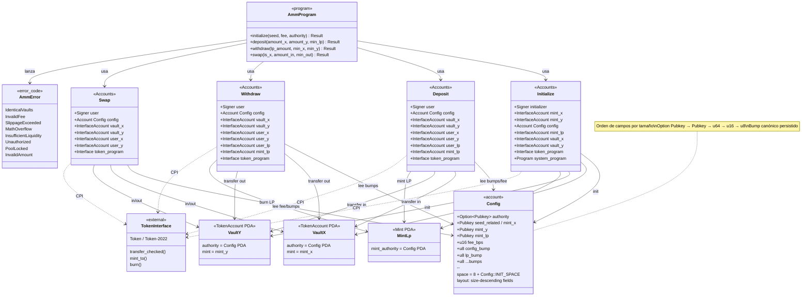

# Diagrama de clases — solana-amm-anchor

Modelo estático del programa AMM (Anchor). Representa cuentas de estado, contextos de instrucción, errores y relaciones con interfaces SPL.

## Notas de diseño

| Elemento | Regla |
|----------|--------|
| `Config` | `#[account]` + discriminator 8 bytes; anti type-cosplay |
| Espacio | Exactamente `8 + Config::INIT_SPACE` |
| Vaults | Claves distintas; authority = PDA `Config` |
| LP | Primer depósito bloquea liquidez mínima |
| Tokens | Solo `token_interface` + `transfer_checked` |
| Math | Constant product; fee sobre input; `u128` + `checked_*` |
