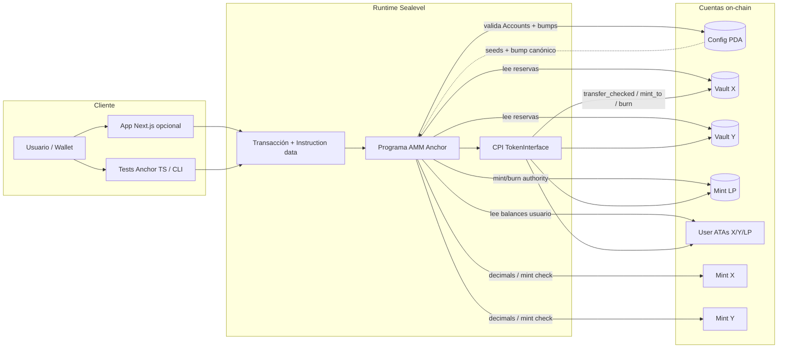
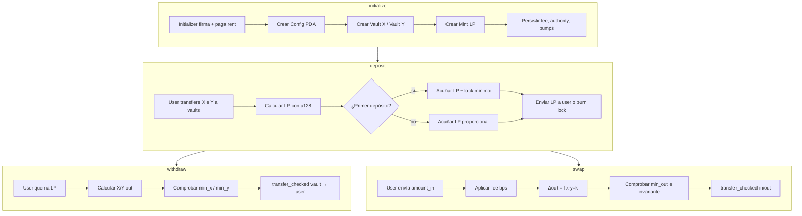

# Diagrama de flujo — solana-amm-anchor

Flujo de datos y componentes entre usuario, cliente, runtime Solana y cuentas del AMM.

## Flujo por operación (vista de datos)

## Límites de confianza

| Capa | Confía en | No confía en |
|------|-----------|--------------|
| Cliente | UX, serialización de args | Validación de seguridad |
| Programa | Constraints Anchor, PDA bumps guardados | Cuentas sin `owner`/discriminator |
| Token program | Interfaces validadas | Program IDs arbitrarios (anti arbitrary CPI) |
