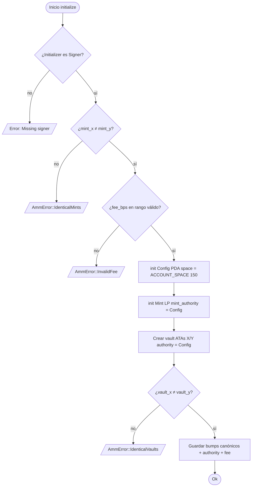
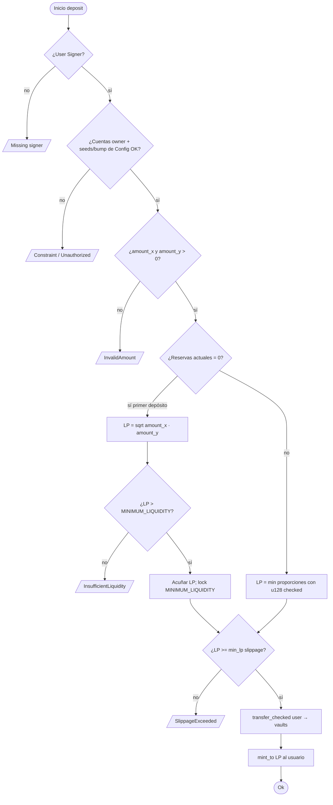
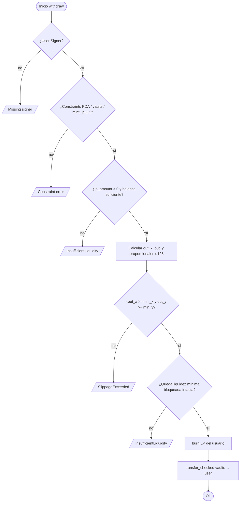
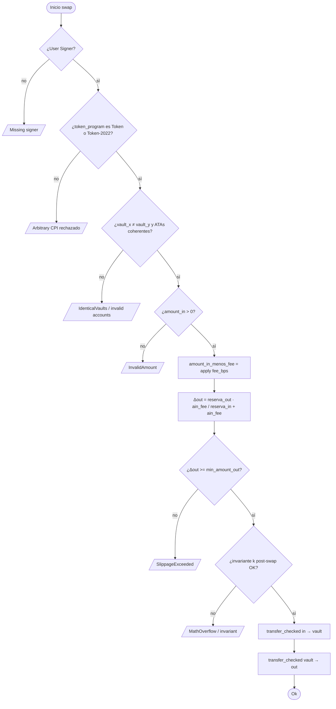
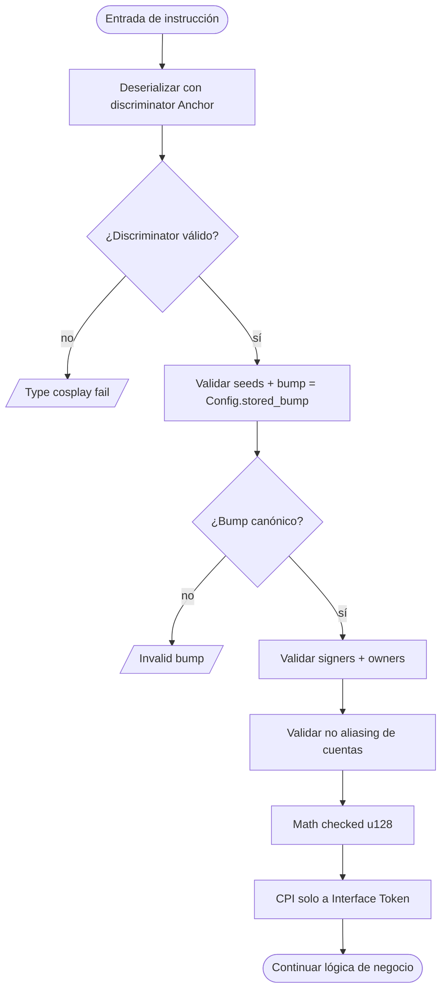

# Flujograma — solana-amm-anchor

Flujogramas de decisión por instrucción (control de errores, validaciones Sealevel y math).

---

## 1. initialize

---

## 2. deposit

---

## 3. withdraw

---

## 4. swap

---

## 5. Camino de seguridad transversal (toda instrucción que muta estado)

---

## Leyenda de errores frecuentes

| Código / condición | Mitigación |
|--------------------|------------|
| Missing signer | `Signer<'info>` |
| Type cosplay | `#[account]` + discriminator |
| IdenticalVaults | `require_keys_neq!` |
| Arbitrary CPI | `Interface<'info, TokenInterface>` |
| SlippageExceeded | `min_out` / `min_lp` / `min_x|y` |
| First deposit inflation | `MINIMUM_LIQUIDITY` lock |
| Overflow | `checked_*` + `u128` |
